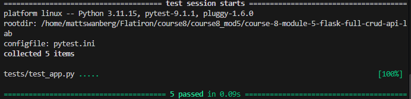

# Flask Full CRUD API Lab

## Overview

This project demonstrates how to build a RESTful API using Flask. The application manages event data using an in-memory Python list and supports creating, updating, and deleting events through HTTP requests.

The project demonstrates the use of:

- Flask routing
- RESTful API conventions
- HTTP POST, PATCH, and DELETE methods
- JSON request and response handling
- Python classes and objects
- In-memory data storage
- Input validation
- HTTP status codes
- Error handling

## Learning Objectives

The goals of this project are to:

- Implement RESTful API endpoints using Flask
- Handle POST, PATCH, and DELETE requests
- Accept JSON input using `request.get_json()`
- Return structured JSON using `jsonify()`
- Store and modify data using in-memory Python objects
- Validate incoming request data
- Return appropriate HTTP status codes

## Project Structure

```text
course-8-module-5-flask-full-crud-api-lab/
├── app.py
├── Pipfile
├── Pipfile.lock
├── README.md
└── tests/
```

## Installation

Clone the repository and navigate into the project directory:

```bash
git clone <repo-url>
cd course-8-module-5-flask-full-crud-api-lab
```

Install the project dependencies using Pipenv:

```bash
pipenv install
```

Enter the virtual environment:

```bash
pipenv shell
```

Verify the Python version:

```bash
python --version
```

This project uses Python 3.11.

## Running the Application

Start the Flask development server:

```bash
python app.py
```

The application will run locally at:

```text
http://127.0.0.1:5000
```

Because debug mode is enabled, Flask will automatically reload when changes to the application are saved.

## Event Model

Events are represented using the `Event` class.

Each event contains:

- `id` - A unique identifier for the event
- `title` - The title of the event

The `to_dict()` method converts an `Event` object into a dictionary so it can be returned as JSON.

The application begins with two events stored in memory:

```text
1 - Tech Meetup
2 - Python Workshop
```

## API Endpoints

### Create an Event

**Endpoint:**

```text
POST /events
```

Creates a new event using JSON request data.

Example request:

```bash
curl -X POST http://127.0.0.1:5000/events \
  -H "Content-Type: application/json" \
  -d '{"title": "Hackathon"}'
```

Example response:

```json
{
  "id": 3,
  "title": "Hackathon"
}
```

Successful requests return:

```text
201 Created
```

If the request does not contain a `title`, the API returns:

```json
{
  "error": "Title is required"
}
```

with:

```text
400 Bad Request
```

### Update an Event

**Endpoint:**

```text
PATCH /events/<event_id>
```

Updates the title of an existing event.

Example request:

```bash
curl -X PATCH http://127.0.0.1:5000/events/1 \
  -H "Content-Type: application/json" \
  -d '{"title": "Hackathon 2025"}'
```

Example response:

```json
{
  "id": 1,
  "title": "Hackathon 2025"
}
```

A successful update returns:

```text
200 OK
```

If the requested event does not exist, the API returns:

```json
{
  "error": "event not found"
}
```

with:

```text
404 Not Found
```

If the request does not contain a `title`, the API returns:

```json
{
  "error": "Title not found"
}
```

with:

```text
400 Bad Request
```

### Delete an Event

**Endpoint:**

```text
DELETE /events/<event_id>
```

Removes the specified event from the in-memory event list.

Example request:

```bash
curl -X DELETE http://127.0.0.1:5000/events/2
```

A successful deletion returns:

```text
204 No Content
```

If the requested event does not exist, the API returns:

```json
{
  "error": "event not found"
}
```

with:

```text
404 Not Found
```

## HTTP Status Codes

The API uses the following HTTP status codes:

| Status Code | Meaning | Usage |
| --- | --- | --- |
| `200` | OK | Event successfully updated |
| `201` | Created | Event successfully created |
| `204` | No Content | Event successfully deleted |
| `400` | Bad Request | Required title is missing |
| `404` | Not Found | Requested event does not exist |

## Input Validation

Incoming JSON data is validated before events are created or updated.

For POST and PATCH requests, the application verifies that a `title` field has been provided.

If the required data is missing, the application stops processing the request and returns a `400 Bad Request` response.

## Error Handling

The API handles common errors including:

- Missing event titles
- Invalid event IDs
- Attempts to update events that do not exist
- Attempts to delete events that do not exist

Error responses are returned as structured JSON along with the appropriate HTTP status code.

## In-Memory Data Storage

This project does not use a database.

Instead, events are stored in an in-memory Python list:

```python
events = [
    Event(1, "Tech Meetup"),
    Event(2, "Python Workshop")
]
```

Changes made through POST, PATCH, and DELETE requests remain available while the Flask application is running.

Restarting the application resets the event list to its original state.

## Testing

Run the automated test suite with:

```bash
pytest
```

To stop testing after the first failure:

```bash
pytest -x
```

The test suite verifies the expected behavior and HTTP status codes for the API endpoints.

## Manual API Testing

The API can also be tested manually using tools such as:

- `curl`
- Postman

When testing with `curl`, keep the Flask server running in one terminal and execute the API requests from a second terminal.

## Screenshot



## Key Takeaways

Through this project, I practiced:

- Creating RESTful Flask routes
- Working with multiple HTTP request methods
- Processing JSON request data
- Returning JSON responses
- Creating and modifying Python objects
- Generating unique event IDs
- Validating incoming API data
- Handling missing resources
- Using HTTP status codes correctly
- Testing Flask API endpoints

## Author

Created by Matthew Swanberg as part of Course 8 Module 5 (Building Full CRUD RESTful APIs with Flask )